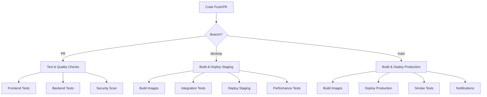

# 🚀 Shopfinity CI/CD Pipeline Documentation

<div align="center">


**Automated CI/CD Pipeline for Shopfinity eCommerce Platform**

[🔧 Setup Guide](#-setup-guide) • [📋 Pipeline Overview](#-pipeline-overview) • [🚀 Deployment](#-deployment) • [🔧 Troubleshooting](#-troubleshooting)

</div>

---

## 📋 Pipeline Overview

Our GitHub Actions pipeline provides comprehensive CI/CD automation for the Shopfinity eCommerce platform, including testing, building, security scanning, and deployment across multiple environments.

### 🎯 **Pipeline Goals**
- **Quality Assurance**: Automated testing and code quality checks
- **Security**: Vulnerability scanning and dependency auditing
- **Consistency**: Standardized build and deployment processes
- **Speed**: Parallel execution and intelligent caching
- **Reliability**: Multi-stage validation and rollback capabilities

### 🔄 **Workflow Triggers**
- **Pull Requests**: Quality gates and testing
- **Push to `develop`**: Staging deployment
- **Push to `main`**: Production deployment
- **Manual Trigger**: On-demand pipeline execution

---

## 🏗️ Pipeline Architecture



---

## 🧪 Pipeline Stages

### **Stage 1: Testing & Quality Assurance**

#### 🎨 Frontend Testing
```yaml
- ESLint code quality checks
- Unit tests with Jest
- Coverage reporting (Codecov)
- Build verification
- Artifact generation
```

#### 🔧 Backend Testing
```yaml
- API testing with real services
- Database integration tests
- Redis and RabbitMQ connectivity
- Environment variable validation
- Health check verification
```

#### 🔒 Security Scanning
```yaml
- Trivy vulnerability scanner
- npm audit for dependencies
- SARIF report generation
- Security policy compliance
- Dependency license checks
```

### **Stage 2: Build & Registry**

#### 🐳 Docker Image Building
```yaml
- Multi-platform builds (AMD64/ARM64)
- GitHub Container Registry
- Intelligent layer caching
- Semantic versioning
- Image vulnerability scanning
```

#### 📦 Artifact Management
```yaml
- Build artifact storage
- Test result preservation
- Coverage report uploads
- Performance metrics
- Deployment manifests
```

### **Stage 3: Integration Testing**

#### 🧪 Full Stack Testing
```yaml
- Docker Compose integration
- End-to-end API testing
- Database connectivity
- Service mesh validation
- Cross-service communication
```

#### 📊 Performance Testing
```yaml
- Lighthouse CI (Performance/A11y/SEO)
- K6 load testing
- Response time validation
- Resource utilization
- Scalability assessment
```

### **Stage 4: Deployment**

#### 🚀 Staging Deployment
```yaml
- Kubernetes manifest application
- Service health verification
- Database migration execution
- Configuration validation
- Smoke test execution
```

#### 🌟 Production Deployment
```yaml
- Blue-green deployment strategy
- Rolling update execution
- Health check validation
- Rollback capability
- Success notifications
```

---

## 🔧 Setup Guide

### **Prerequisites**
- GitHub repository with admin access
- Kubernetes cluster (staging and production)
- Container registry access (GitHub Container Registry)
- Slack workspace (optional, for notifications)

### **1. Repository Configuration**

#### Enable GitHub Actions
```bash
# Ensure Actions are enabled in repository settings
# Settings > Actions > General > Allow all actions
```

#### Set up Environments
```bash
# Go to Settings > Environments
# Create environments: "staging" and "production"
# Configure protection rules and required reviewers
```

### **2. Required Secrets**

Add these secrets in **Settings > Secrets and variables > Actions**:

#### 🔐 **Required Secrets**
```bash
# Kubernetes Configuration
KUBE_CONFIG_STAGING      # Base64 encoded kubeconfig for staging
KUBE_CONFIG_PRODUCTION   # Base64 encoded kubeconfig for production

# Notifications (Optional)
SLACK_WEBHOOK_URL        # Slack webhook URL for notifications
```

#### 📋 **How to Generate Secrets**

**Kubernetes Configuration:**
```bash
# Encode your kubeconfig file
cat ~/.kube/config | base64 -w 0

# Copy the output and add as KUBE_CONFIG_STAGING/KUBE_CONFIG_PRODUCTION
```

**Slack Webhook (Optional):**
```bash
# Create a Slack app and webhook
# https://api.slack.com/messaging/webhooks
# Add the webhook URL as SLACK_WEBHOOK_URL
```

### **3. Branch Protection Rules**

Configure branch protection in **Settings > Branches**:

#### Main Branch Protection
```yaml
- Require pull request reviews
- Require status checks to pass
- Require branches to be up to date
- Include administrators
- Restrict pushes
```

#### Develop Branch Protection
```yaml
- Require status checks to pass
- Require branches to be up to date
- Allow force pushes (for hotfixes)
```

### **4. Environment Configuration**

#### Staging Environment
```yaml
Environment name: staging
Protection rules:
  - Required reviewers: 1
  - Wait timer: 0 minutes
  - Deployment branches: develop
```

#### Production Environment
```yaml
Environment name: production
Protection rules:
  - Required reviewers: 2
  - Wait timer: 5 minutes
  - Deployment branches: main
```

---

## 🚀 Deployment Workflows

### **Development Workflow**

#### 1. Feature Development
```bash
# Create feature branch
git checkout -b feature/new-feature

# Make changes and commit
git add .
git commit -m "feat: add new feature"

# Push and create PR
git push origin feature/new-feature
# Create PR to develop branch
```

#### 2. Pull Request Process
```bash
# Automated checks run:
✅ Frontend tests
✅ Backend tests  
✅ Security scanning
✅ Code quality checks

# Manual review required
# Merge after approval
```

#### 3. Staging Deployment
```bash
# Merge to develop triggers:
✅ Build Docker images
✅ Integration tests
✅ Deploy to staging
✅ Performance tests
✅ Smoke tests

# Access staging: https://staging.shopfinity.com
```

#### 4. Production Release
```bash
# Create release PR: develop → main
# Additional review required
# Merge triggers production deployment

# Production deployment:
✅ Build production images
✅ Deploy to production
✅ Health checks
✅ Notifications
```

### **Hotfix Workflow**

#### Emergency Production Fix
```bash
# Create hotfix branch from main
git checkout main
git checkout -b hotfix/critical-fix

# Make fix and test
git commit -m "fix: critical production issue"

# Push and create PR to main
git push origin hotfix/critical-fix
# Create PR with "hotfix" label

# Fast-track review and merge
# Automatic production deployment
```

---

## 📊 Monitoring & Observability

### **Pipeline Metrics**

#### Build Performance
- **Build Time**: Target < 10 minutes
- **Test Coverage**: Minimum 80%
- **Success Rate**: Target > 95%
- **Deployment Frequency**: Daily releases

#### Quality Gates
- **Security Vulnerabilities**: Zero high/critical
- **Code Quality**: ESLint passing
- **Performance**: Lighthouse score > 80
- **Load Testing**: Response time < 500ms

### **Monitoring Dashboards**

#### GitHub Actions Dashboard
```bash
# View pipeline status
https://github.com/your-org/shopfinity/actions

# Monitor workflow runs
# Check deployment status
# Review test results
```

#### Application Monitoring
```bash
# Staging environment
https://staging.shopfinity.com/health

# Production environment  
https://shopfinity.com/health

# Kubernetes dashboard
kubectl get pods -n shopfinity
```

---

## 🔧 Troubleshooting

### **Common Issues**

#### 1. **Build Failures**

**Frontend Build Fails:**
```bash
# Check Node.js version compatibility
# Verify package.json dependencies
# Review ESLint errors in logs

# Debug locally:
npm install
npm run lint
npm run build
```

**Backend Build Fails:**
```bash
# Check service dependencies
# Verify environment variables
# Review database connections

# Debug locally:
cd backend
npm install
npm test
```

#### 2. **Test Failures**

**Unit Tests Failing:**
```bash
# Review test logs in Actions
# Check for environment differences
# Verify mock data and fixtures

# Run tests locally:
npm test -- --verbose
```

**Integration Tests Failing:**
```bash
# Check service startup order
# Verify database connections
# Review Docker Compose logs

# Debug locally:
docker-compose -f docker-compose.test.yml up
docker-compose logs
```

#### 3. **Deployment Issues**

**Kubernetes Deployment Fails:**
```bash
# Check cluster connectivity
# Verify kubeconfig secrets
# Review resource quotas

# Debug commands:
kubectl get pods -n shopfinity
kubectl describe deployment backend -n shopfinity
kubectl logs -f deployment/backend -n shopfinity
```

**Image Pull Errors:**
```bash
# Verify image tags and registry
# Check authentication
# Review image build logs

# Debug commands:
docker pull ghcr.io/your-org/shopfinity/backend:latest
kubectl get events -n shopfinity
```

#### 4. **Performance Issues**

**Lighthouse Scores Low:**
```bash
# Review performance recommendations
# Check bundle sizes
# Optimize images and assets

# Local testing:
npm run build
npx lighthouse http://localhost:3000
```

**Load Tests Failing:**
```bash
# Review response times
# Check resource limits
# Scale services if needed

# Debug load tests:
k6 run tests/load/basic-load-test.js --vus 1 --duration 30s
```

### **Debug Commands**

#### Pipeline Debugging
```bash
# View workflow runs
gh run list

# View specific run details  
gh run view <run-id>

# Download artifacts
gh run download <run-id>

# Re-run failed jobs
gh run rerun <run-id>
```

#### Local Testing
```bash
# Test Docker builds locally
docker build -t shopfinity-frontend .
docker build -t shopfinity-backend ./backend

# Test Docker Compose
docker-compose -f docker-compose.test.yml up

# Test Kubernetes manifests
kubectl apply --dry-run=client -f k8s/
```

---

## 📈 Performance Optimization

### **Build Optimization**

#### Caching Strategy
```yaml
# GitHub Actions cache
- uses: actions/cache@v4
  with:
    path: ~/.npm
    key: ${{ runner.os }}-node-${{ hashFiles('**/package-lock.json') }}

# Docker layer caching
cache-from: type=gha
cache-to: type=gha,mode=max
```

#### Parallel Execution
```yaml
# Run jobs in parallel
jobs:
  test-frontend:
    runs-on: ubuntu-latest
  test-backend:
    runs-on: ubuntu-latest
  security-scan:
    runs-on: ubuntu-latest
```

### **Resource Management**

#### Runner Optimization
```yaml
# Use appropriate runner sizes
runs-on: ubuntu-latest-4-cores  # For heavy builds
runs-on: ubuntu-latest          # For standard jobs
```

#### Service Optimization
```yaml
# Optimize service startup
services:
  postgres:
    options: >-
      --health-cmd pg_isready
      --health-interval 10s
      --health-timeout 5s
      --health-retries 5
```

---

## 🔒 Security Best Practices

### **Secret Management**
- Use GitHub Secrets for sensitive data
- Rotate secrets regularly
- Limit secret access to necessary workflows
- Use environment-specific secrets

### **Image Security**
- Scan images for vulnerabilities
- Use minimal base images
- Keep dependencies updated
- Sign container images

### **Access Control**
- Use least privilege principle
- Require code reviews
- Enable branch protection
- Monitor workflow permissions

---

## 📚 Additional Resources

### **Documentation Links**
- [GitHub Actions Documentation](https://docs.github.com/en/actions)
- [Docker Best Practices](https://docs.docker.com/develop/dev-best-practices/)
- [Kubernetes Documentation](https://kubernetes.io/docs/)
- [Security Scanning with Trivy](https://aquasecurity.github.io/trivy/)

### **Useful Commands**
```bash
# GitHub CLI commands
gh workflow list
gh workflow run ci-cd.yml
gh workflow view ci-cd.yml

# Docker commands
docker system prune -a
docker buildx ls
docker buildx create --use

# Kubernetes commands
kubectl get workflows
kubectl describe workflow ci-cd
kubectl logs -f workflow/ci-cd
```

### **Configuration Files**
- `.github/workflows/ci-cd.yml` - Main pipeline configuration
- `.lighthouserc.json` - Performance testing config
- `tests/load/basic-load-test.js` - Load testing script
- `docker-compose.test.yml` - Integration testing setup

---

## 🤝 Contributing to Pipeline

### **Adding New Tests**
1. Create test files in appropriate directories
2. Update workflow configuration
3. Add necessary service dependencies
4. Document test requirements

### **Modifying Deployment**
1. Update Kubernetes manifests
2. Test changes in staging first
3. Update pipeline configuration
4. Document deployment changes

### **Performance Improvements**
1. Profile current performance
2. Implement optimizations
3. Measure improvements
4. Update documentation

---

## 📞 Support

### **Getting Help**
- **Issues**: [GitHub Issues](https://github.com/your-org/shopfinity/issues)
- **Discussions**: [GitHub Discussions](https://github.com/your-org/shopfinity/discussions)
- **Slack**: #shopfinity-devops (if available)

### **Emergency Contacts**
- **Production Issues**: Create incident ticket
- **Pipeline Failures**: Tag @devops-team
- **Security Issues**: Follow security policy

---

<div align="center">

**🚀 Happy deploying with Shopfinity CI/CD!**

Made with ❤️ by the Shopfinity DevOps team

[⬆ Back to Top](#-shopfinity-cicd-pipeline-documentation)

</div>